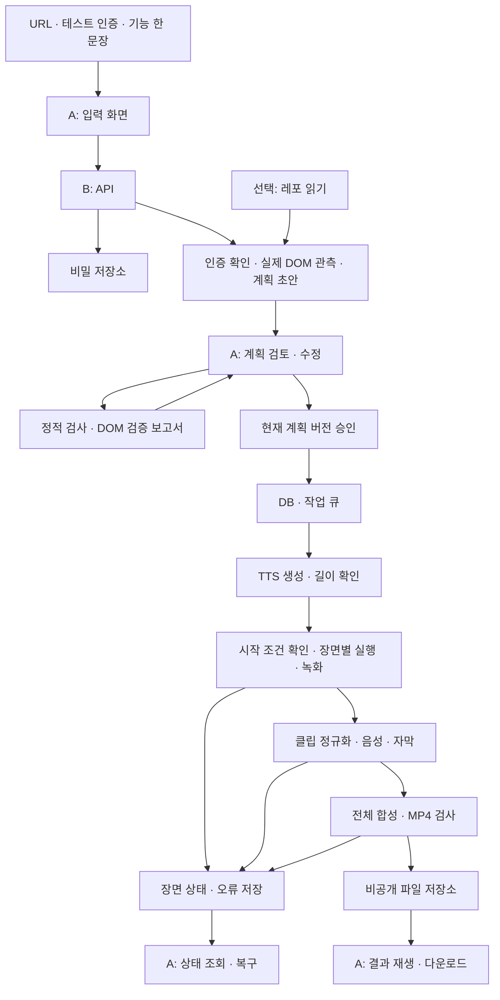

# 웹앱 데모 영상 자동 생성 — 시스템 설계

> 2026-09-11 갱신: 사용자가 실서비스 전환을 승인했습니다. 현재 구현·배포 경계는 [README](README.md)와 [DEPLOYMENT](DEPLOYMENT.md), 검증 사실은 [TESTING](TESTING.md)을 따릅니다. 아래 v0.1 문서의 미확정·PoC 상태는 작성 당시 기록입니다.
작성일: 2026-09-09 · 설계 버전: v0.1 · 고정 PoC 구현 진행. 실제 검증 상태는 [README](README.md)·[TESTING](TESTING.md) 참조

제품 범위·수용 기준은 [요구사항](01_REQUIREMENTS.md), 필드·API·상태값은 [공유 계약](03_CONTRACT.md)을 따른다. 이 문서는 기술 선택과 그 이유를 설명한다. 버전 번호는 라이브러리 버전이 아니라 설계 버전이다.

## 1. 먼저 고쳐야 할 원문의 전제

| 원문 취지 | 설계에 반영할 정확한 의미 |
|---|---|
| AI는 계획만, 실행은 결정론적 | 승인된 액션·대상·입력·순서가 고정된다. 외부 앱의 데이터와 네트워크까지 동일한 결과를 보장한다는 뜻은 아니다 |
| 컨텍스트를 다시 만들면 세션이 풀린다 | 새 컨텍스트에 인증 상태를 주입할 수 있다. 로그인 성공과 보호 화면 접근은 각 진입 시 다시 검사한다 |
| recordVideo는 컨텍스트 단위다 | 설정은 컨텍스트에 하고 영상은 페이지별로 생긴다. MVP는 장면마다 컨텍스트 1개·페이지 1개를 쓰며 팝업 흐름은 제외한다 |
| 세션 파일이면 소셜 로그인·OTP가 모두 해결된다 | 이미 완료한 인증 상태를 재사용하는 경로다. 만료, 기기·IP 결합, sessionStorage 등은 별도 제약이며 모든 사이트를 보장하지 않는다 |
| 장면 시작 URL이면 부분 재실행 가능하다 | URL 외에 서버 데이터의 사전 조건·변경 영향·결과 확인이 필요하다. 쿠키 복원은 DB 롤백이 아니다 |
| 내레이션이 장면 길이를 결정한다 | TTS 실측 길이가 시간 예산의 기준이며, 실제 액션이 더 오래 걸리면 이를 함께 반영해야 한다 |
| 서버리스에는 배포할 수 없다 | 브라우저·인코딩 워커에 필요한 실행 시간·CPU·메모리·파일 보관을 충족하는 환경이 필요하다. 프론트·가벼운 API까지 일괄 배제할 이유는 없다 |

인증 상태 재사용과 sessionStorage의 별도 처리는 [Playwright 인증 문서](https://playwright.dev/docs/auth), 녹화 저장 시 컨텍스트 종료 대기와 크기 설정은 [Playwright 영상 문서](https://playwright.dev/docs/videos)를 확인했다. 나머지 운영 경계는 이 제품을 위한 설계 판단이다.

## 2. 권장 구성

2인이 타입을 공유하기 쉬운 TypeScript 중심 구성을 제안한다. 기존 팀의 선호 스택이 확인되면 계약을 유지하면서 바꿀 수 있다.

| 영역 | 제안 | 선택 이유 |
|---|---|---|
| 프론트 | React + Vite + TypeScript | 복잡한 서버 렌더링 없이 폼·장면 상태를 구현. 우선 지역 상태와 reducer로 충분 |
| 공유 계약 | Zod 기반 런타임 스키마 + 추론 타입 + 생성된 API 명세 | 프론트 타입과 서버 검증이 서로 어긋나는 것을 줄임 |
| API | Node.js + Fastify | JSON 계약과 인증·검증·비동기 작업 요청을 작은 API로 분리 |
| DB·큐 | PostgreSQL + pg-boss | 메타데이터와 작업 큐를 같은 DB에 두어 Redis 운영을 추가하지 않음 |
| 실행 워커 | Node.js + Playwright Chromium | 실제 DOM 검증, 테스트 계정 로그인, 장면별 녹화 |
| 렌더 | ffmpeg·ffprobe | 규격 통일, 길이 측정, 자막·음성 합성, MP4 출력 |
| AI·음성 | Planner·Narrator 어댑터 | PoC의 고정 계획·고정 음원을 이후 실제 제공자로 교체 |
| 저장 | 로컬에서는 전용 볼륨, 배포 시 비공개 오브젝트 저장소 | API와 워커가 다른 서비스일 때 로컬 디스크 공유를 가정하지 않음 |
| 실행 환경 | Docker Compose로 로컬 재현, 배포는 상시 컨테이너 워커 | 브라우저·ffmpeg·한글 폰트 버전을 고정 |

pg-boss는 Node.js·PostgreSQL 기반 작업 큐다. 큐의 전달 보장과 별개로, 외부 웹앱에서 수행한 변경을 중복 없이 복구하는 책임은 실행기에 있다. [pg-boss 공식 저장소](https://github.com/timgit/pg-boss)

배포처는 아직 선택하지 않았다. Railway는 Docker 서비스와 영속 볼륨을 제공하는 후보이지만, 처리 시간·디스크·메모리·실제 비용은 PoC 결과로 확인해야 한다. [Railway 서비스 문서](https://docs.railway.com/services)

## 3. 데이터 흐름

초기 상태 전달은 2초 간격 조회를 제안한다. 작업 상태는 DB에 있고 브라우저 탭의 생존 여부와 무관하다. 수요가 확인되면 동일한 상태 모델 위에 SSE를 붙인다. 처음부터 웹소켓·별도 이벤트 시스템을 운영하지 않는다.

## 4. 계획 생성과 검증

1. 대상 URL·리다이렉트·네트워크 접근 정책을 검사한다.
2. 입력 화면에서 허용한 테스트 로그인·열람을 수행한다. 로그인 성공 조건이 확인되지 않으면 계획 생성을 중단한다.
3. 접근 가능한 화면에서 역할·레이블·test id 등을 포함한 실제 요소 목록과 간단한 화면 근거를 수집한다. 비밀번호·세션 토큰·불필요한 개인 데이터는 AI 입력에서 제외한다.
4. AI가 관측된 자료를 근거로 목표를 장면·액션·내레이션으로 바꾼다. 원문 레포와 웹페이지 내용은 참고 데이터이며 명령 권한을 갖지 않는다.
5. 스키마·URL·허용 액션·의존 관계·길이를 정적으로 검사한다.
6. DOM 검증 결과를 현재 확인됨, 실행 시 확인 필요, 실행 불가로 나눠 사용자에게 보여준다.
7. 수정과 검증이 끝난 특정 계획 버전만 승인한다. 실행 워커는 승인된 계획을 다시 작성하지 않는다.

**아직 생성하지 않은 데이터의 버튼을 미리 검증할 수는 없다.** 실행 시 확인이 필요한 대상은 실제 관측한 반복 구조와 승인된 입력값으로 특정할 수 있을 때만 조건부로 허용한다. 예: 관측된 업무 행 구조에서 이번에 입력할 고유 제목으로 행을 한정한다. 근거가 없는 대상은 AI 추측으로 채우지 않고 샘플 데이터·접근 가능한 화면을 준비하도록 요청한다.

데이터를 생성·변경해야만 접근할 수 있는 화면을 살피기 위해 승인 전 몰래 시나리오를 실행하지 않는다. 별도 준비 작업이 필요하면 변경 내용이 있는 계획으로 사용자 검토를 거친다. MVP는 준비된 테스트 화면에서 조작 대상을 관측할 수 있는 흐름부터 지원한다.

실행 직전 대상이 정확히 하나인지, 보이는지, 해당 액션을 할 수 있는지 다시 검사한다. 0개·복수 매칭·시간 초과는 해당 장면의 실패다. AI 보정이 필요하면 새 계획 버전으로 돌아가 다시 승인한다. Playwright의 단일 요소 액션은 복수 매칭을 오류로 처리한다. [Playwright locators](https://playwright.dev/docs/locators)

GitHub 분석을 추가할 경우 파일 트리·README → 필요한 파일만 읽는 2단계로 제한한다. 목표와 무관한 파일, 비밀 파일, 바이너리, 과도한 크기를 제외한다. README와 코드의 충돌은 불확실성으로 기록하고, 현재 실제 화면 관측을 우선한다. 이 접근의 토큰 절감률·정확도 개선은 측정 전 수치로 주장하지 않는다.

## 5. 인증·브라우저·실제 앱 데이터

### 인증

- 폼 로그인과 세션 업로드를 지원 경로로 정의한다. 로그인 폼도 실제 관측한 요소를 사용하며 인식하지 못하면 입력 바인딩 수정 또는 세션 경로를 안내한다.
- 세션 파일을 직접 만들기 어려운 사용자를 위해 로컬에서 창이 보이는 브라우저를 여는 내보내기 도우미를 제안한다. 사용자가 그 창에서 직접 로그인하면 지원하는 인증 상태만 파일로 저장해 업로드한다. 기존 브라우저의 모든 로그인 정보를 수집하는 확장 기능은 만들지 않는다. 도우미의 인증 재사용 범위도 별도로 테스트한다.
- 폼의 계정·암호, 업로드 세션과 갱신 세션은 암호화된 별도 저장소에 둔다. Plan에는 불투명 참조만 들어간다.
- 초기 지원 범위는 쿠키·localStorage 기반 인증이다. IndexedDB 등은 어댑터로 확장 가능하게 하되 테스트하지 않은 인증을 지원한다고 표기하지 않는다. sessionStorage 전용 인증은 MVP 미지원으로 표시한다.
- 각 장면 시작 시 최신 유효 인증 상태로 새 컨텍스트를 만들고 보호 화면 접근을 확인한다. 세션이 회전하면 같은 작업의 다음 장면은 갱신 상태를 사용한다.
- 전체 작업 완료·취소·종료 후 인증 자료를 폐기한다. 계획 검토·실행 중 최대 보관 시간의 제안값은 2시간이며, 만료되면 중지·재인증한다. 촬영 후 다시 찍으려면 재인증이 필요할 수 있음을 UI에 표시한다.
- 원본 클립·음성만으로 가능한 재합성은 재인증 없이 허용한다. 인증 자료를 장기간 남겨 재시도를 편하게 만드는 방식은 기본값으로 삼지 않는다.

### 장면 시작 상태

장면마다 직접 돌아갈 URL, 준비 완료 조건, 필요한 데이터 조건, 성공 조건을 지정한다. 새로고침으로 복원되지 않는 모달·일시적 메모리 상태만을 장면 진입점으로 쓰지 않는다. 필요한 모달 열기 등은 해당 장면의 명시적 액션으로 포함한다.

실행 구간을 작게 나눠도 대상 앱의 DB는 공유된다. 앞 장면에서 만든 데이터 ID와 결과 근거를 실행 기록에 남기고, 뒤 장면은 그 결과를 의존 입력으로 참조한다. 해당 기록은 인증 상태 파일과 별개다.

## 6. 부분 재실행과 장애 복구

부분 재실행의 약속은 **“유효한 기존 클립을 보존하고, 변경·실패의 영향을 받은 최소 범위를 다시 만든다”**이다. 어떤 장면이든 무조건 혼자 안전하게 다시 실행할 수 있다는 약속은 하지 않는다.

| 변경·실패 | 기본 처리 |
|---|---|
| 독립적인 조회 장면 실패 | 해당 장면만 다시 찍고 최종 영상 재합성 |
| 자막 수정 | 원본 클립을 재사용해 해당 렌더와 전체 합성 갱신 |
| 내레이션 수정 | TTS·타이밍·해당 렌더 갱신. 액션 시각까지 바뀌어야 하면 재촬영 범위를 표시 |
| 액션·진입 URL·사용 데이터 변경 | 해당 장면과 영향을 받는 후속 장면의 클립 무효화 |
| 데이터 생성 중 워커 종료 | 부작용 발생 여부를 먼저 확인. 알 수 없으면 자동 반복하지 않고 사용자 조치 요청 |
| 세션 만료 | 완료 클립 유지, 재인증 후 필요한 장면부터 재개 |
| 최종 합성만 실패 | 검증된 장면 결과를 재사용해 합성 단계만 재시도 |

장면별로 읽는 자원과 쓰는 자원, 선행 장면, 재실행 정책을 기록한다. 사용자가 순서를 바꾸면 의존성이 유지되는지 검사한다. 같은 데이터에 쓰는 장면의 복제는 고유 데이터 키 변경 또는 사전 조건 수정을 요구한다.

데이터 변경 액션은 실행 의도 기록 → 실제 클릭 → 결과 확인 → 결과 기록 순서로 처리한다. 클릭과 기록 사이에 죽을 수 있으므로 정확히 한 번의 외부 변경을 일반적으로 보장할 수 없다. 고유 테스트 데이터 키와 사후 조회로 이미 완료됐는지 판별할 수 있을 때만 복구한다. 확인 불가능한 경우 작업을 멈춘다.

DB의 작업 생성·한도 예약은 한 트랜잭션으로 처리한다. API 중복 요청 키와 장면 시도 식별자를 저장한다. 브라우저 작업은 큐의 무조건 자동 재시도를 끄고, 중단 시 앱 상태 확인 후 재개한다. 파일 기반 렌더·합성만 제한 횟수 자동 재시도를 허용한다.

## 7. 녹화와 시간 설계

### 촬영

장면마다 새 컨텍스트·페이지를 만들고 viewport와 녹화 크기를 모두 1280×720으로 고정한다. 원본은 장면별로 보관한다. 컨텍스트를 닫고 저장 완료를 기다린 뒤 후처리한다. Playwright의 기본 녹화 크기를 그대로 사용하면 원하는 해상도를 얻지 못할 수 있다. [Playwright 영상 문서](https://playwright.dev/docs/videos)

페이지가 준비되기 전에 녹화된 공백·로그인 대기 화면은 완성 클립에서 제거한다. 액션 시작 전 실제 녹화 프레임에 포착되는 임시 동기화 표시를 넣어 시간 기준을 잡고, 표시 자체는 출력에서 잘라낸다. PoC에서 이 기준이 안정적인지 확인한다. 영상 PTS와 단순 작업 시작 시각이 같다고 가정하지 않는다.

커서는 애플리케이션 UI를 바꾸지 않는 시각적 오버레이로 주입하고 실제 마우스 이벤트의 경로와 맞춘다. 액션별 대상 위치를 검사한 뒤 커서를 이동하고 클릭한다. 클릭 직전에 대상이 움직였다면 재측정한다. 커서·자막·줌은 실제 캡처에 덧붙이는 설명이며, 존재하지 않은 UI 생성과 구분한다.

### 길이와 동기화

1. 승인된 내레이션으로 TTS를 생성하고 실제 길이를 측정한다. 편집 화면의 낭독 시간은 추정치다.
2. 각 액션은 장면 시작 기준의 가장 이른 실행 시각을 가질 수 있다. 실제 조작·결과 확인에 더 오래 걸리면 실제 시간이 우선한다.
3. 장면 길이는 `max(음성 끝 시각, 마지막 필수 액션·결과 확인 완료 시각) + 마무리 여유`로 결정한다.
4. 실제 촬영이 짧으면 마지막 정상 프레임을 제한된 시간만 유지할 수 있다. 제안 상한은 3초다. 길게 멈춰야 한다면 내레이션·장면을 조정한다.
5. 장면 최대 길이 또는 최종 75초 상한을 넘으면 조용히 자르거나 말을 과속하지 않는다. 수정이 필요한 장면을 표시한다.
6. 자막 구간은 실제 TTS 길이 또는 제공자의 타이밍 정보를 기준으로 만들고, 액션과 설명의 의미 일치는 영상 검수에서 확인한다.

내레이션 편집에 따라 액션 시각을 재조정해야 하는 경우 기존 원본 클립으로 항상 해결할 수는 없다. 재합성 가능 여부를 서버가 판단하고 사용자에게 재촬영 범위를 알려준다.

### 출력

각 장면을 동일한 크기·픽셀 형식·프레임률·음성 규격으로 정규화하고 0부터 시작하는 타임스탬프로 합친다. 자막 없는 실제 원본은 재합성을 위해 보존한다. 최종 MP4의 길이·트랙·규격을 검사한 후에만 성공 처리한다. FFmpeg concat 필터는 장면의 스트림 구성이 일치해야 하며 해상도 등의 명시적 통일이 필요하다. [FFmpeg concat 문서](https://ffmpeg.org/ffmpeg-filters.html#concat)

출력 30fps 변환은 촬영 중 놓친 움직임을 복원하지 않는다. 기본 녹화로 글자·커서 품질이 게이트를 넘지 못하면 캡처 방식을 교체하는 기술 검증을 먼저 진행하며, 후처리로 고칠 수 있다고 가정하지 않는다.

## 8. 저장과 서비스 운영

DB에는 프로젝트·계획 버전·검증 보고서·승인·작업·장면 시도·산출물·한도 예약을 저장한다. 대용량 영상과 인증 자료를 일반 작업 레코드에 섞지 않는다. 비밀 자료의 암호화 키는 DB와 분리된 서버 환경에 둔다.

| 항목 | 초기 제안값·정책 |
|---|---|
| 브라우저·인코딩 동시 처리 | 워커 1개, 고비용 작업 동시 1개부터 측정 |
| 계획 크기 | 1~6개 장면, 장면당 최대 20개 액션 |
| 실행 상한 | 액션 기본 제한 10초, 단일 촬영 장면 30초, 전체 작업 10분. 길이 예산과 별도 관리 |
| 사용자별 횟수 | 익명 작업 세션당 하루 3회 생성 예약, IP 제한은 보조 수단. 실패·취소의 사용량 반환 규칙을 서버에서 일관되게 적용 |
| AI·음성 | 호출 횟수·입력 크기·문자 수 제한, 프로젝트 일일 비용 상한 초과 시 새 예약 거부. 실제 금액은 팀 예산 확정 후 설정 |
| 파일 보관 | 원본·진단·완성 영상 기본 24시간. 시연용 대표 영상은 별도 고정 보관 여부 결정 |
| 저장 부족 | 새 작업 접수 중단, 임시 파일 정리, 기존 성공 산출물 보존 |

공개 서비스의 작업 소유권은 서버가 발급한 추측 불가능한 세션으로 식별한다. 모든 조회·수정·다운로드에 소유권을 검사한다. 세션 쿠키, CSRF 방어, 짧은 수명의 다운로드 링크를 적용한다. UUID만 알고 있으면 다른 사람의 영상을 볼 수 있는 구조로 만들지 않는다.

사용자가 URL을 입력하는 구조이므로 브라우저의 모든 네트워크 요청에 내부 주소·메타데이터 주소 차단을 적용한다. 최상위 URL뿐 아니라 리다이렉트·하위 요청·DNS 재해석·WebSocket도 같은 정책을 따른다. 허용 여부는 실제 연결 IP 기준으로 집행할 수 있는 네트워크 경계를 둔다. 로컬 더미 앱 예외는 격리된 개발 환경에만 둔다.

워커는 작업별 브라우저 프로세스와 임시 디렉터리를 분리하고 Chromium sandbox를 유지한다. 브라우저 프로세스에 AI 키·DB 비밀번호를 전달하지 않는다. 브라우저 컨텍스트만 나누는 것을 컨테이너·네트워크 격리와 동일하다고 설명하지 않는다. 컨테이너별 작업 격리를 어디까지 제공할지는 배포 PoC로 검증한다.

## 9. 2인 작업 경계와 다음 구현 순서

아래 경계로 PoC 코드가 구현되었다. 실제 AI·TTS·운영 기능은 README의 상태표로 구분한다.

| 제안 경로 | 소유자 | 책임·접근 경계 |
|---|---|---|
| `apps/web/` | A | 입력·계획·진행·결과 화면. 공유 계약의 타입과 생성 클라이언트 사용 |
| `apps/api/` | B | 소유권·입력 검증·승인·작업 접수·조회·파일 접근 |
| `apps/worker/` | B | 계획 생성·DOM 관측·로그인·녹화·렌더·복구 |
| `apps/demo/` | B | 로그인·업무 생성/완료·초기화가 있는 고정 검증 앱 |
| `packages/contracts/` | A+B | 유일한 공유 코드 경계. 런타임 스키마·타입·API 명세·목 데이터 |
| `infra/` | B | 컨테이너·DB·저장·네트워크·한도 설정 |

공유 계약 변경은 변경 이유·A/B 영향·호환 방식부터 팀에 공유하고 반영한다. A는 계약과 자신의 화면 코드만으로 작업할 수 있어야 하고 B의 DB·큐·브라우저 내부 타입을 가져오지 않는다.

구현 시 우선순위:

1. A+B: 계약 v0.1과 고정 예제 합의. 정상·실패·재실행 화면이 같은 타입을 쓰도록 한다.
2. B: 더미 앱과 고정 Plan으로 3장면 촬영, 동기화·커서·합성, 독립 장면 실패와 데이터 변경 중단을 검증한다.
3. A: 같은 고정 예제로 계획 폼·진행·복구·결과 흐름을 연결한다.
4. 공동: 2~3일 안에 영상을 보고 계속 진행할지 판정한다. 결과가 나쁘면 AI 연결보다 캡처·복구 문제를 먼저 해결한다.
5. B: 실제 Planner·DOM 검증·Narrator 연결 후 외부 앱 3개 검증. A는 그 실패 유형을 UI로 연결한다.

남은 가장 큰 기술적 위험은 **외부 앱의 데이터 변경을 포함한 흐름을 안전하게 재현하면서 쓸 만한 촬영 품질을 얻을 수 있는가**이다. 설계 검토만으로 이 위험이 해결됐다고 판단할 수 없다.
