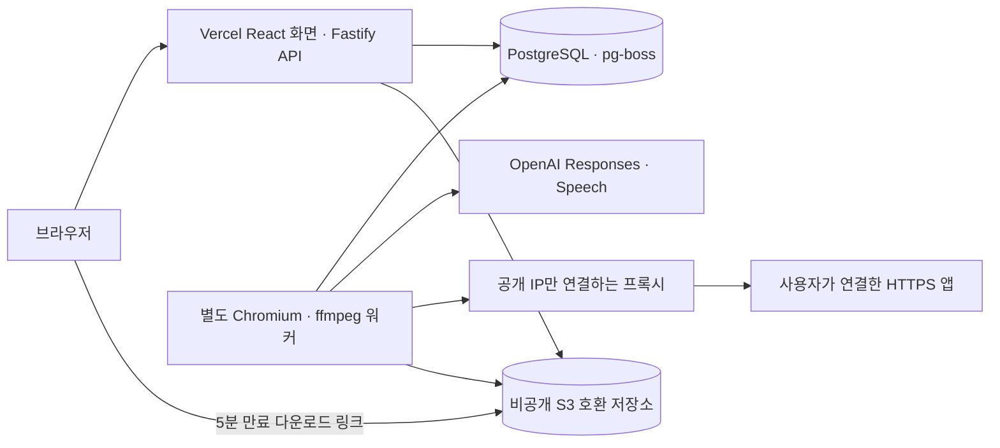

# DemoReel 서비스 배포

사용자 확정(2026-09-11): Vercel 프론트·API + 별도 워커, OpenAI 계획·음성, 이메일·비밀번호 로그인. 이 문서는 배포 준비 절차다. 실제 외부 배포와 키를 사용하는 호출은 아직 수행하지 않았다.

## 구성

화면과 API를 같은 Vercel 프로젝트·도메인에 둔다. API는 요청 인증, 계획 저장, 승인, 큐 등록, 상태 조회, 다운로드 링크 발급을 수행한다. 브라우저·ffmpeg는 API 함수에서 실행하지 않는다. 영상 본문은 Vercel을 통과하지 않아 함수 응답 크기 제한을 피한다. [Vercel 함수 제한](https://vercel.com/docs/functions/limitations), [Fastify 서버리스 가이드](https://fastify.dev/docs/latest/Guides/Serverless/)

## 환경변수

`.env.example`의 모든 인증값은 공란이다. 실제 값은 호스팅 환경의 비밀값 설정에 입력한다. `VITE_` 접두사로 비밀값을 만들지 않는다.

| 변수 | Vercel API | 워커 | 의미 |
|---|---|---|---|
| NODE_ENV | production | production | PoC 모드 사용 금지 |
| POC_MODE | false | false | 고정 계획·음원 경로를 사용하지 않음 |
| DATABASE_URL | 필요 | 필요 | 같은 논리 DB. 워커는 direct 또는 session pooling 연결 사용 |
| ENCRYPTION_KEY | 필요 | 같은 값 | 32바이트를 64자리 hex로 표현한 키, 인증 자료 암호화 |
| WEB_ORIGIN | 실제 HTTPS 서비스 origin | 같은 값 | 예: https://서비스도메인 |
| OPENAI_API_KEY | 불필요 | 필요 | 실제 모델·음성 호출 |
| OPENAI_PLANNER_MODEL | 불필요 | gpt-5-mini | 바꿀 수 있는 모델 ID |
| OPENAI_TTS_MODEL | 불필요 | gpt-4o-mini-tts | 음성 모델 |
| OPENAI_TTS_VOICE | 불필요 | coral | 음성 ID |
| S3_ENDPOINT | 필요 시 | 같은 값 | 공급자별 HTTPS API endpoint. AWS 기본 endpoint는 생략 가능 |
| S3_REGION | 필요 | 같은 값 | 공급자 region. AWS는 실제 region 지정 |
| S3_BUCKET | 필요 | 같은 값 | 공개 접근을 차단한 버킷 |
| S3_ACCESS_KEY_ID / S3_SECRET_ACCESS_KEY | 필요 | 필요 | 버킷 접근 자격 증명. 역할에 맞는 권한 사용 |
| DAILY_QUOTA | 기본 3 | 선택 | 사용자별 하루 생성 상한 |
| DAILY_PLAN_QUOTA | 기본 10 | 선택 | 사용자별 하루 계획 요청 상한 |
| GLOBAL_DAILY_JOBS | 기본 50 | 선택 | 서비스 전체 하루 생성 상한 |
| HOST | 불필요 | 0.0.0.0 | 워커 상태 확인용 리스닝 주소 |
| DATA_DIR | /tmp/demo-reel | /app/output | 워커의 임시 녹화·렌더 디렉터리 |

워커가 OpenAI·저장소 설정을 갖추고 heartbeat를 기록해야 생성 버튼이 활성화된다. heartbeat는 자격 증명 존재 여부와 프로세스 생존 신호이며, 실제 공급자 인증·잔액 검증은 아니다. 잘못된 키나 공급자 오류는 작업 실패로 표시된다.

## 준비 순서

1. PostgreSQL DB와 비공개 S3 호환 버킷을 준비한다. 워커의 pg-boss와 단일 실행 잠금은 지속 연결을 사용하므로 transaction pooling 주소를 워커에 사용하지 않는다. Vercel API의 데이터 풀은 인스턴스당 2개, 큐 초기화용 풀은 1개 연결로 제한한다.
2. API·워커에 위 환경변수를 설정한다. 워커에는 브라우저 샌드박스가 가능한 Linux, Chromium, ffmpeg/ffprobe, 한글 폰트가 필요하다.
3. 동일 코드 버전에서 `pnpm db:migrate`를 **직접 연결 DB 주소로 1회 실행**한다. API 콜드 스타트에서는 스키마를 변경하지 않는다.
4. 워커에서 `pnpm start:worker`를 실행한다. `infra/worker.Dockerfile`과 `infra/worker.compose.yaml`을 사용할 수 있다. 실행 서버 업체는 아직 지정하지 않았다.
5. Vercel에서 저장소 루트를 프로젝트로 선택하고 Framework Preset을 Other로 둔다. 저장소의 `vercel.json`이 설치·빌드·출력 경로·API rewrite를 지정한다. 프론트 출력은 `apps/web/dist`, API 진입점은 `api/index.ts`다.
6. 실제 HTTPS 도메인을 WEB_ORIGIN에 반영한다. 회원 가입 → 테스트 앱 연결 → 계획 검토·승인 → 영상 생성·다운로드를 검증한다.

S3 CORS는 서비스 origin에서 GET·HEAD 및 Range 재생을 허용한다. 공개 읽기 권한은 추가하지 않는다. 워커는 PutObject/GetObject/DeleteObject, API는 다운로드 서명을 위한 읽기 권한을 사용한다. 저장소 lifecycle에도 `artifacts/`의 1일 만료를 설정해 워커 장애 시 보관 기간이 무한히 늘어나지 않도록 한다.

## 지원 범위와 운영 조건

- 공개 HTTPS, 쿠키·localStorage 기반 폼 로그인 또는 세션 파일을 지원한다. 사용자가 로그인 URL, 입력 대상, 성공 URL·대상을 지정한다. 인증 없이 공개 화면을 사용하는 모드도 있다.
- 탐색은 앱 주소와 사용자가 지정한 최대 5개 추가 주소를 열람한다. 클릭·입력으로 화면을 자동 탐색하지 않는다. 필요한 API·CDN origin은 최대 5개 연결 origin 안에서 명시한다. WebSocket·팝업·OTP/CAPTCHA·sessionStorage 전용 인증은 지원하지 않는다.
- AI는 관측한 locator 목록을 사용해 계획을 생성한다. 관측되지 않은 화면을 자동 성공으로 처리하지 않는다. 데이터 변경은 사용자가 승인한 계획에서 실행하며, 불확실한 변경은 자동 반복하지 않는다.
- Chromium 트래픽은 요청마다 DNS를 검사하고 확인된 공개 IP로 연결하는 프록시를 통과한다. 브라우저 sandbox를 켜며 비밀 환경변수를 브라우저 자식 프로세스에 전달하지 않는다. 실제 Linux 호스트에서 sandbox 기동과 네트워크 격리를 확인한 뒤 공개한다.
- 회원 비밀번호는 scrypt로 저장하고, 세션은 서버 DB에서 만료·취소한다. 비밀번호 변경은 모든 기존 세션을 무효화한다. 이메일 인증과 비밀번호 분실 메일은 이 버전에 포함하지 않는다. 메일 공급자 선택과 별도 구현이 필요하다.
- 인증 자료는 최대 2시간, 영상은 24시간 보관한다. 워커는 만료 자료를 주기적으로 정리한다. 실패한 저장소 정리는 다음 주기에 재시도한다. 작업 메타데이터는 작업 목록을 위해 유지한다.
- 음성은 AI 생성임을 화면에 알린다. 자막은 짧은 문장 단위로 TTS를 요청하고 실제 오디오 길이에 맞춘다. 발음·자연스러움과 실제 모델 계획 품질은 키 입력 후 검수해야 한다. [OpenAI Speech](https://developers.openai.com/api/docs/guides/text-to-speech), [Structured Outputs](https://developers.openai.com/api/docs/guides/structured-outputs)

## 아직 실제 환경에서 확인하지 않은 항목

실제 OpenAI 계정의 모델 사용 권한·청구·음성 품질, 선택한 S3 업체와의 호환성·CORS·lifecycle, Linux Docker sandbox, Vercel 배포 후 rewrite·쿠키·DB 연결을 확인해야 한다. 모의 API 테스트와 로컬 빌드를 외부 연동 성공으로 보지 않는다. 배포·커밋·푸시는 이번 구현 과정에서 수행하지 않는다.
